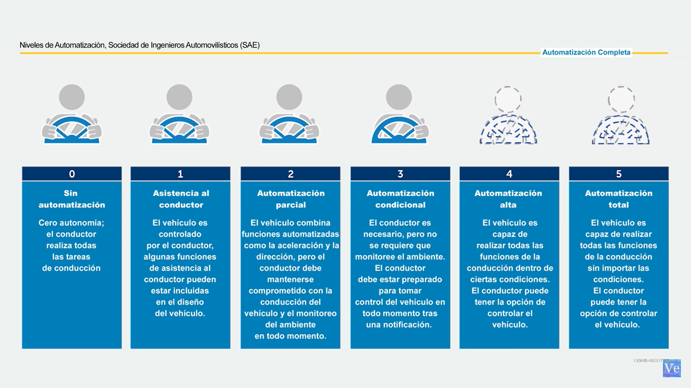
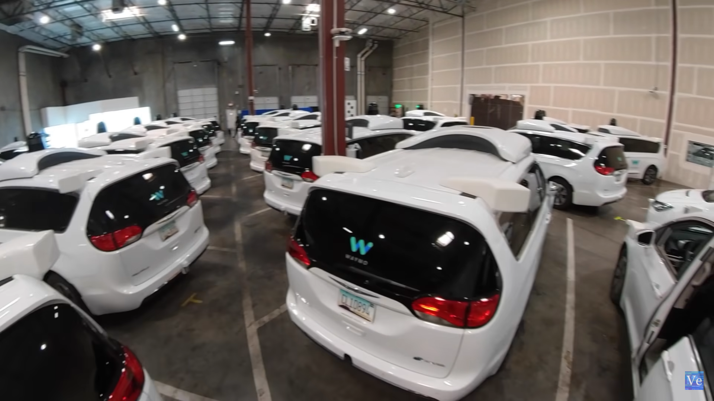
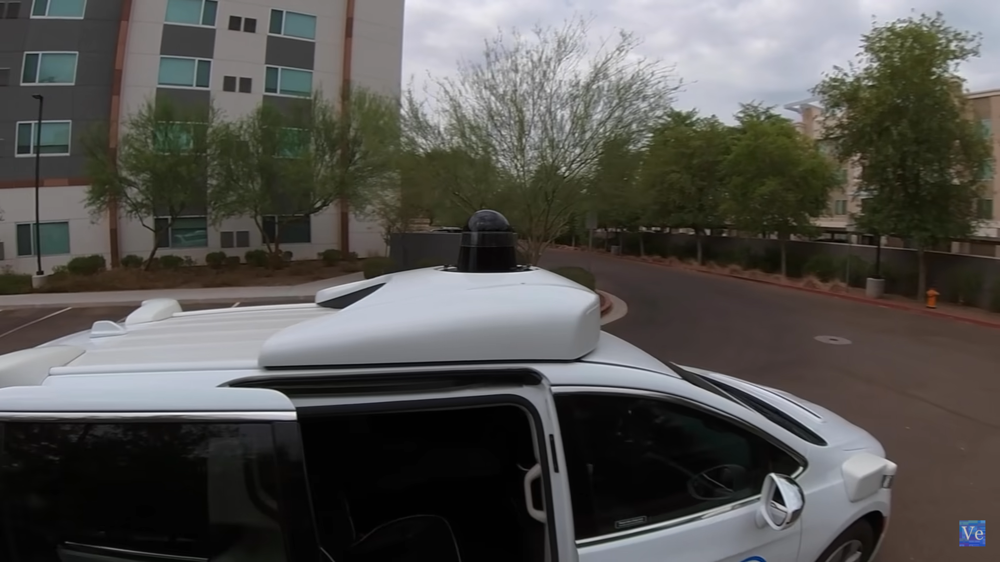
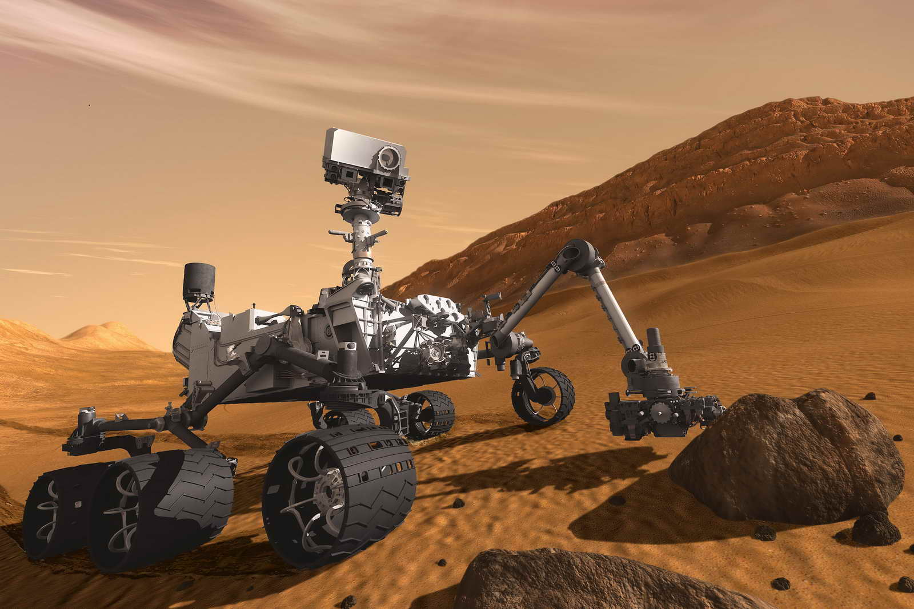
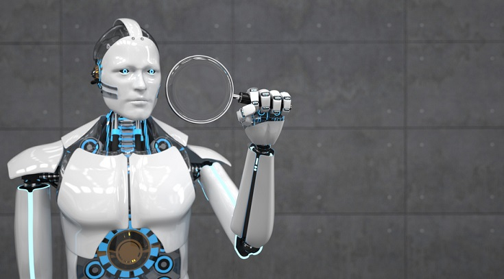

# ¿Por qué es preferible que haya autos sin conductor en el la calle?

Quien recibe al pasajero parece ser una inteligencia artificial.

Mucha gente que piensa que aun estamos muy lejos de los autos que se conducen solos 

Hay ciudades donde aun no es posible que conduzcan este tipo de automviles 

Waymo es el proyecto de automóviles autónomos de Google  

Uno de los primeros modelos no tiene tablero. 

Me llama la atención como al remover el tablero también se le quitaron otras elementos como el aire acondicionado. 

Otra detalle a resaltar es el botón para detener el vehículo de emergencia, como el freno de mano que tiene en los autos tradicionales. 

Se tiene una analogía de que antes los elevadores tenia conductores 🛗 

Y como de igual forma la gente le tenia rechazo a tomarlos prefiriendo subir escaleras antes de tomar un elevador. 

Pregunta de reflexión. ¿Si se puede hacer que un auto se conduzca solo, se podría hacer que pase lo mismo con otros transportes como el avión o ya es demasiado complejo? ✈️

Algunos aviones tiene piloto automático y otras computadoras que ayudan a los pilotos para lugares donde sus sentidos no son suficientes para pilotear el avión con normalidad como niebla o lluvias. 

 

---

# Niveles de autonomía

En los primero intentos de Google se dieron cuenta de que algunos conductores se confiaban de lo tecnología y eso podría causar accidentes. 

---

### Foto de la bodega de toda la flotilla de Waymo

---

Su equipo se divide en dos partes

1. Despachadores de la flota. Se encarga de corradina toda la logística. Asigna las misiones a cada día. Suena como una operación militar en la que cada técnico asigna una misión aun automóvil y de que se completen con éxito. 
2. Equipo de asistencia al pasajero, que es como un Call Center o un Service Desk que se encarga de atender las solicitudes de los clientes. 

A la gente que opone resistencia a ser llevado por un automóvil autónomo después de unos minutos viajando se olvidan que no hay conductor. 

 

---

El 94% de los accidentes se lleva a cabo por el factor humano

Laidar es el radar que lanza rayos laser invisibles para hacerse una imagen tridimensional de todo a su alrededor.   

---

Recuerdo una conferencia de Elon Musk en la que habla a los estudiantes de tecnología, retándolos a imagina sus propios autos que se conducen solos. Y cuando termino les dijo porque no se lo imaginan en lugares como, nieve o en el agua o incluso en otro planeta. Ya que también quería motivarlos a pensar fuera del molde. 

---

El auto intenta predecir a donde pueden ir las cosas. Apoyado de la ciencia de datos. Crea simulaciones de a donde están los objetos, a donde podría estar, o a donde se irán. De esta forma le ayuda a tomar decisiones de cual sería su siguiente acción. También aplica otra propiedad de la inteligencia artificial. Entre más se use más aprenderán los automóviles respecto a como comportarse. 

 

---

# Comentarios personales y más información.

[Introduction to Artificial Intelligence (AI)](https://www.coursera.org/learn/introduction-to-ai)

En un curso de Coursera, que habla sobre inteligencia artificial menciona algunos mitos de la misma. Como que muchos piensa que la IA va a remplazar a los humanos. Aquí nos explica que eso no es cierto sino que la IA esta hay para apoyar a los humanos. 

Incluso en algunas ocasiones la IA esta para apoyar a los humanos en cosas para lo que nuestros cuerpos humanos no están capacitados para hacer, como explorar las profundidades del océano o las superficies de otros planetas. 

---

# Audita a la Inteligencia Artificial

En el mismo curso se nos mención que las IA puede pasar por sesgos o prejuicios. 

Por ejemplo que el auto haya sido precargadas con imágenes de motociclistas sin caso e infiera que es más seguro atropellar a alguien con casco que a alguien sin casco. 

Aquí existe todo un dilema moral respecto a quien es la responsabilidad de esto tipo de accidentes, si el programador quien es quien diseño ese algoritmo, el mecánico quien diseño el hardware o si se puede juzgar a la inteligencia artificial como si fuera una persona. 

Por eso para evitar ese tipo de situaciones se recomienda cada cierto tiempo auditar a la IA, para detectar estos sesgos, y sirvan para la toma de decisiones en las próximos diseños de los vehículo

---

# Otros artículos de interés

## El Tesla Bot

[Otros articulos de interes](https://platzi.com/blog/elon-musk-anuncia-tesla-bot/?fbclid=IwAR2t1SuVrYI9wgofZnJ6sSXcvN60s2IiRUYzaVCdWYCiAvoJdO2VcBvY89E)

---

# Mira el video completo

[https://youtu.be/Q2LdNDDdYOk](https://youtu.be/Q2LdNDDdYOk)

---

# Sobre el autor

<a class="badge-base__link LI-simple-link" href="https://mx.linkedin.com/in/fernando-sanchez-mejia?trk=profile-badge">Fernando Sanchez Mejia</a>
          

### Fernando Sánchez Mejía

### ITIL Fundamentals v4

### Consultor de TI - Risk Advisory - Deloitte

---